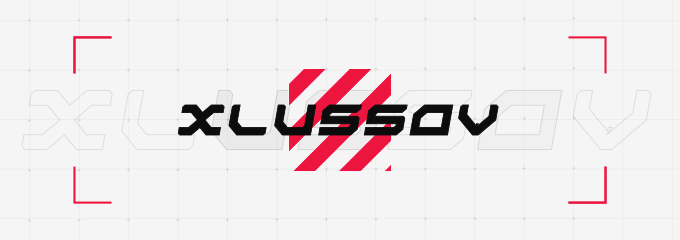

  

<h1 align="center">Hey bro, I'm Danil Hlusov</h1>

  Passionate developer from Ukraine, working with <strong>React, TypeScript, MUI</strong> to build productive web applications.

 

<!-- 

  

 -->

---
<!-- 
### 🛠️ Main technologies

  
  
  

---

### 🔥 What I’m Currently Working On

- Building scalable web applications using **React** and **MUI**.
- Creating dynamic UI components with **TypeScript**.
- Exploring new front-end technologies to optimize performance.

---

### ✨ Fun Facts

- I love solving challenging problems and optimizing user experiences.
- Big fan of **design systems** and creating reusable components.
- Always learning new technologies to stay updated!

---

### 📈 GitHub Stats

  

---

### 🌍 Let's Connect

  
  

- [Укрїнська](./README.ua.md) -->